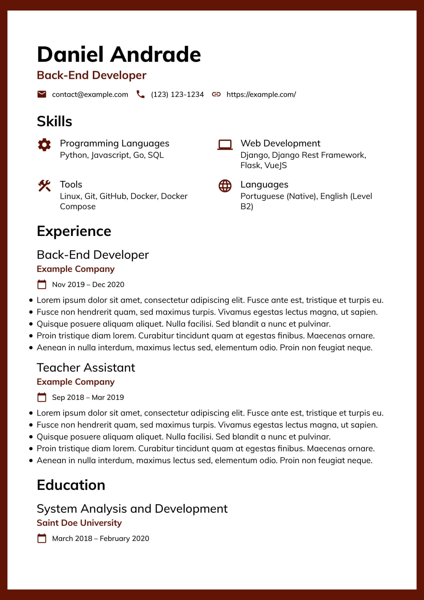

# Caju

This is a Vue project I made so I could easily write my resume using web technologies. A web page allows me to get better font rendering, a finer control of the design and a better separation of concerns.

While it may be my resume, you can easily change it to fit your needs.

<p align="center">
  <a href="readme-assets/preview.pdf">
    
  </a>
</p>

## Project Setup

You need to make sure you have NodeJS and NPM in your computer. Then, simply run `npm install` inside the project root to install the dependencies.

## Usage

The data is separated of the rest of the project. In `data/data.example.json` you'll find placeholder data meant to be changed and filled with your personal data.

Create a new `.json` file inside the data folder, provide your information, and change the import inside `src/App.vue` to point to your new file.

```js
// Change this to point to your new file
import json from "../data/data.example.json";
```

Once you're done, simply run `npm run serve` to serve the project on localhost.

Use Firefox's print to file function to save it as a PDF.

## Language Support

Since I intend to apply both for Brazillian and international companies, the project has English and Portuguese support.

### Switching from English to Portuguese

Inside `src/App.vue`, change `lang: "en"` to `lang: "pt"`.

I also keep two diferent json data files: `data.en.json` for English and `data.pt.json` for Portuguese.

See the usage section to learn how to import different data files.

## Personalization

The project is divided in different files that can be easily edited to fit your needs. Go to the section's respective component (inside `src/components/`) and change them.

Instead of using plain HTML and CSS, I've used the Pug and SCSS since it's more succinct. If you don't know Pug or SCSS, they are really easy to learn if you know HTML and CSS. Check [this website for Pug](https://pugjs.org/api/getting-started.html) and [this website for SCSS](https://sass-lang.com/guide).

## Contributing

Pull requests for small fixes are welcome. For major changes, feel free to fork it and personalize the project to fit your needs.

## License

[GPL-3.0](https://choosealicense.com/licenses/gpl-3.0/)
